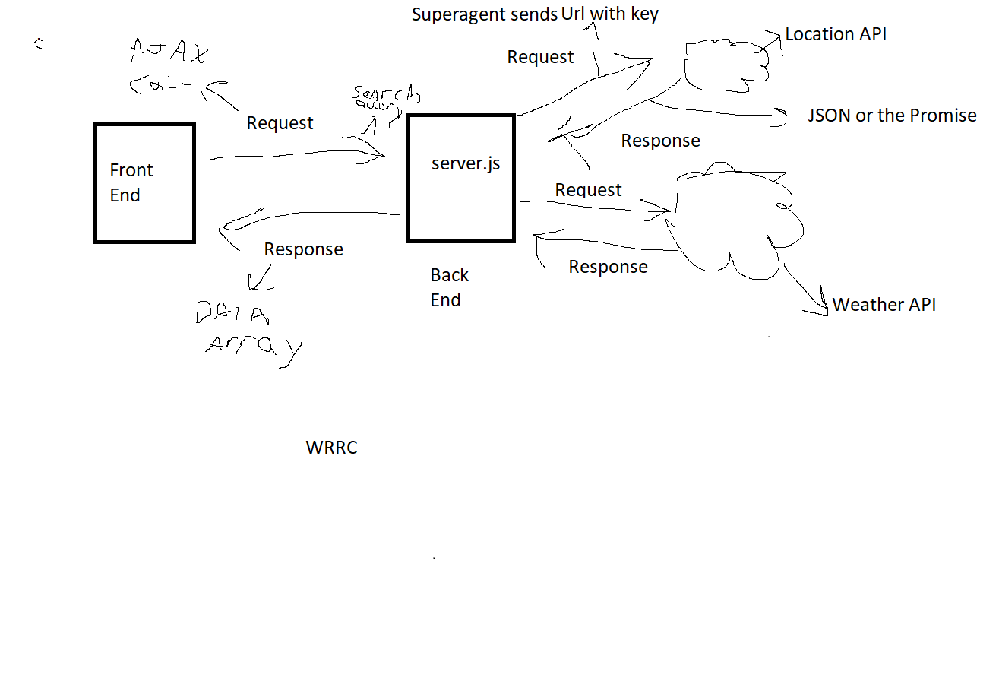

# Back End Lab, City Viewer Lab-06-09

## Overview
This project will be using a pre built front end website to test out the functionality of the back-end side I am making. Using node and heroku to deploy and have a working server, the problem at hand is giving the front end part of the website information when calling the back end via ajax.

**Version**: 1.1.1

# Contribution

 As always thank you MDN!

## Author: Cristian Robles/Code Fellows

### Comments

- Took a bit to figure out the problem but once I have solved it went as a breeze

## Getting Started

### Number and name of feature:

1. Repository Set Up

Estimate of time needed to complete: 30min

Start time: 8:00pm

Finish time: 8:16pm

Actual time needed to complete: 15min  

Number and name of feature:  
2. Set up Server with requestin data from weather and location endpoints and having a response depending on invalid user input.

Estimate of time needed to complete: 3 Hours

Start time: 8:20pm

Finish time: 10:30pm

Actual time needed to complete: 1 Hour 30mins  

3. Refactored code to request data from an api and send that back as a response instead of using pre set json files.

Estimate of time needed to complete: 3 Hours

Start time: 09:00pm

Finish time: 10:40pm

Actual time needed to complete: 1 Hour 40mins

## Architecture
Using Javascript with Node.js and it's libraries and a couple of dependecies(dotenv,express,cors).  

### WRRC 
  

## Change Log
<!-- Use this area to document the iterative changes made to your application as each feature is successfully implemented. Use time stamps. Here's an examples: !-->
12-30-2020 10:40pm Ver 1.2.0  - Changed API to request from other APIs and use the promise data to convert and send back as a response to the front end request

12-23-2020 12:05am Ver: 1.1.1 - Fixed bug happening with flag trigger staying to true so if statement wouldn't allow proper response to be sent

12-23-2020 11:45pm Ver: 1.1.0- Application now has a fully-functional express server, with a GET route for the location resource. When couple of fall backs as to when not desirable inputs happen.  

